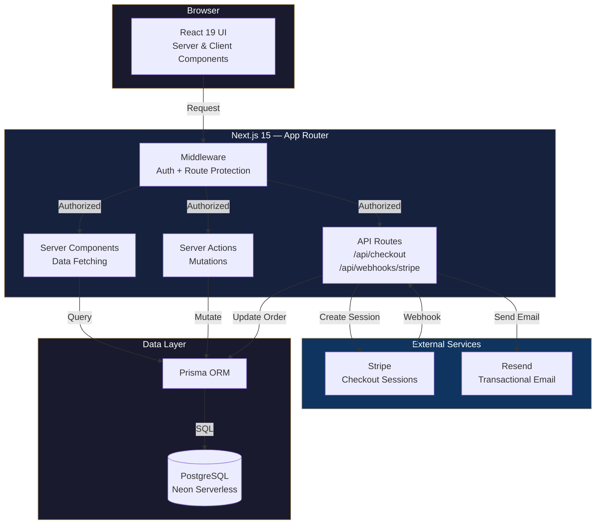
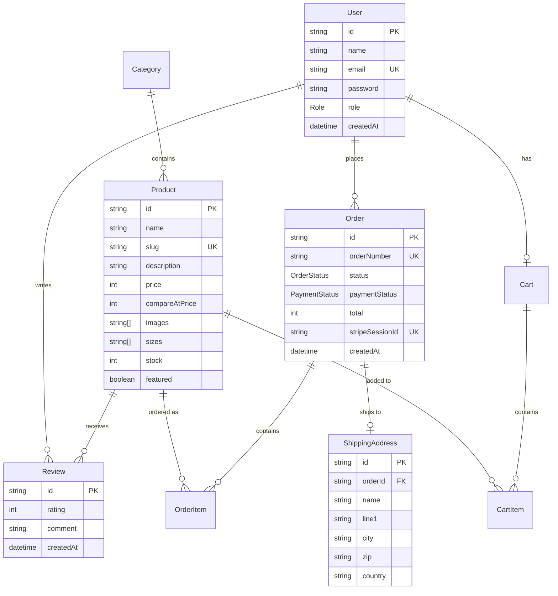

<div align="center">

# LUXE

### Luxury Fashion E-Commerce Platform

A production-grade, full-stack e-commerce application built with **Next.js 15**, **React 19**, **Stripe**, and **PostgreSQL**. End-to-end — from storefront to admin dashboard, authentication to payment processing.

[](https://nextjs.org/)
[](https://react.dev/)
[](https://www.typescriptlang.org/)
[](https://stripe.com/)
[](https://neon.tech/)
[](https://tailwindcss.com/)
[](https://www.prisma.io/)

</div>

---

## Why This Project

Most portfolio e-commerce apps stop at "add to cart." LUXE goes further — it implements the **real-world concerns** that separate production systems from tutorials:

- **Optimistic stock locking** to prevent overselling during concurrent checkouts
- **Webhook-driven order fulfillment** with Stripe signature verification
- **Transactional email delivery** via Resend on payment confirmation
- **Role-based access control** with middleware-level route protection
- **Full admin back-office** with KPI dashboards and order lifecycle management
- **Security hardening** with HSTS, CSP, clickjacking protection, and bcrypt password hashing

---

## Tech Stack

| Layer | Technology | Purpose |
|:------|:-----------|:--------|
| **Framework** | Next.js 15 (App Router) | Server Components, Server Actions, Middleware |
| **UI** | React 19, Tailwind CSS 3.4, shadcn/ui | Component system with Radix primitives |
| **Language** | TypeScript 5.7 (strict) | End-to-end type safety |
| **Database** | PostgreSQL (Neon serverless) | Pooled connections via `@neondatabase/serverless` |
| **ORM** | Prisma 6.2 | Schema-first, type-safe database access |
| **Auth** | NextAuth.js v5 (beta) | JWT sessions, Credentials provider, RBAC |
| **Payments** | Stripe Checkout + Webhooks | PCI-compliant payment processing |
| **Email** | Resend | Transactional order confirmation emails |
| **Validation** | Zod | Runtime schema validation on forms & API inputs |
| **Charts** | Recharts | Admin dashboard revenue visualization |
| **Icons** | Lucide React | Consistent icon system |

---

## Architecture



---

## Database Schema



---

## Features

### Storefront

- **Product Catalog** — Filterable by category, sortable, with full-text search
- **Product Detail** — Image gallery, size selector, stock validation, customer reviews
- **Shopping Cart** — Add / update / remove items with real-time cart count in header
- **Stripe Checkout** — Redirect to hosted Stripe Checkout with shipping address collection
- **Order History** — View past orders with status & payment badges
- **Reviews** — Star rating (1-5) and optional text comments

### Authentication & Authorization

- **JWT Sessions** — 24-hour stateless sessions via NextAuth.js v5
- **Middleware Protection** — `/admin/*`, `/orders`, `/checkout`, `/cart` guarded at the edge
- **Role-Based Access** — ADMIN and CUSTOMER roles enforced server-side
- **Secure Registration** — Passwords hashed with bcrypt (12 rounds)

### Admin Dashboard

- **KPI Cards** — Total revenue, order count, average order value, new customers
- **Revenue Chart** — Monthly revenue bar chart (Recharts)
- **Product Management** — Full CRUD with form validation (Zod)
- **Order Management** — Update order status through the lifecycle (Pending → Confirmed → Processing → Shipped → Delivered)
- **Customer Overview** — Customer list with order history and spend

### Checkout Flow

```
Cart → POST /api/checkout → Stripe Checkout Session
                                    ↓
                           Customer pays on Stripe
                                    ↓
                    Stripe fires webhook → POST /api/webhooks/stripe
                                    ↓
                    ┌───────────────────────────────────┐
                    │  • Verify Stripe signature         │
                    │  • Update order → CONFIRMED         │
                    │  • Update payment → PAID            │
                    │  • Save shipping address            │
                    │  • Clear customer cart              │
                    │  • Send confirmation email (Resend) │
                    └───────────────────────────────────┘
                                    ↓
                        Redirect to /checkout/success
```

**Edge cases handled:**
- Session expiration (30 min) → stock restored, order cancelled
- Payment failure → payment status set to FAILED
- Email failure → logged, does not block order completion
- Concurrent checkout → optimistic stock locking prevents overselling

---

## Security

| Measure | Implementation |
|:--------|:---------------|
| **Password Hashing** | bcrypt with 12 salt rounds |
| **Session Strategy** | JWT with 24-hour expiration |
| **Route Protection** | NextAuth middleware on protected paths |
| **Webhook Verification** | Stripe signature validation on all events |
| **SQL Injection** | Prisma parameterized queries |
| **Clickjacking** | `X-Frame-Options: DENY` |
| **MIME Sniffing** | `X-Content-Type-Options: nosniff` |
| **HSTS** | `Strict-Transport-Security` with 2-year max-age, preload |
| **Referrer Policy** | `strict-origin-when-cross-origin` |
| **Permissions Policy** | Camera, microphone, geolocation disabled |
| **Input Validation** | Zod schemas on all user-facing inputs |

---

## Project Structure

```
src/
├── app/                          # Next.js App Router
│   ├── admin/                    # Admin dashboard (protected)
│   │   ├── customers/page.tsx
│   │   ├── orders/page.tsx
│   │   ├── products/page.tsx
│   │   ├── layout.tsx
│   │   └── page.tsx              # KPIs + revenue chart
│   ├── api/
│   │   ├── auth/[...nextauth]/   # NextAuth endpoints
│   │   ├── checkout/             # Stripe session creation
│   │   └── webhooks/stripe/      # Stripe webhook handler
│   ├── cart/page.tsx
│   ├── checkout/
│   │   ├── cancel/page.tsx
│   │   ├── success/page.tsx
│   │   └── page.tsx
│   ├── login/page.tsx
│   ├── orders/page.tsx
│   ├── products/
│   │   ├── [id]/page.tsx         # Product detail + reviews
│   │   └── page.tsx              # Catalog with filters
│   ├── register/page.tsx
│   ├── globals.css
│   └── layout.tsx                # Root layout + fonts
│
├── components/
│   ├── admin/                    # Admin-specific components
│   ├── auth/                     # Login & register forms
│   ├── cart/                     # Cart items, summary
│   ├── checkout/                 # Checkout form, order complete
│   ├── layout/                   # Header, footer, admin sidebar
│   ├── orders/                   # Order list, status badges
│   ├── products/                 # Cards, grid, filters, gallery
│   ├── reviews/                  # Review form & list
│   └── ui/                       # shadcn/ui primitives (14 components)
│
├── lib/
│   ├── actions/                  # Server Actions
│   │   ├── auth.ts               # Register, login
│   │   ├── cart.ts               # CRUD cart operations
│   │   ├── orders.ts             # Order status updates
│   │   ├── products.ts           # Product CRUD (admin)
│   │   └── reviews.ts            # Create review
│   ├── auth.config.ts            # NextAuth route config + RBAC
│   ├── auth.ts                   # NextAuth instance
│   ├── constants.ts              # Statuses, sizes, tax rate
│   ├── prisma.ts                 # Prisma singleton
│   ├── stripe.ts                 # Stripe singleton
│   ├── resend.ts                 # Resend singleton
│   └── utils.ts                  # cn(), formatPrice(), formatDate()
│
├── types/index.ts                # Shared TypeScript types
└── middleware.ts                  # Auth middleware + route matcher

prisma/
├── schema.prisma                 # 9 models, 3 enums
├── seed.ts                       # 2 users, 5 categories, 20 products, 10 reviews, 5 orders
└── migrations/
```

---

## Design System

### Typography

| Role | Font | Weight |
|:-----|:-----|:-------|
| Headings | Playfair Display (serif) | 400–700 |
| Body | Inter (sans-serif) | 300–700 |

### Color Palette

| Token | Value | Usage |
|:------|:------|:------|
| `gold` | `#C9A96E` | Primary brand color, CTAs, accents |
| `gold-light` | `#D4BC8E` | Hover states |
| `gold-dark` | `#B08D4F` | Active states |
| `background` | `hsl(0 0% 100%)` | Page background |
| `foreground` | `hsl(0 0% 3.9%)` | Primary text |
| `muted` | `hsl(0 0% 96.1%)` | Secondary surfaces |
| `destructive` | `hsl(0 84.2% 60.2%)` | Errors, delete actions |

### Component System

Built on [shadcn/ui](https://ui.shadcn.com/) with Radix primitives — 14 base components (Button, Card, Dialog, Input, Select, Table, etc.) extended with domain-specific components for products, cart, orders, and admin.

---

## Getting Started

### Prerequisites

- Node.js 18+
- PostgreSQL database ([Neon](https://neon.tech/) recommended)
- [Stripe](https://stripe.com/) account (test mode)
- [Resend](https://resend.com/) account

### 1. Clone & Install

```bash
git clone https://github.com/mer-prog/luxe-store.git
cd luxe-store
npm install
```

### 2. Configure Environment

```bash
cp .env.example .env
```

Fill in your credentials:

```env
# Database (Neon PostgreSQL)
DATABASE_URL="postgresql://..."
DIRECT_URL="postgresql://..."

# Auth
AUTH_SECRET="openssl rand -base64 32"
AUTH_URL="http://localhost:3000"

# Stripe
STRIPE_SECRET_KEY="sk_test_..."
STRIPE_WEBHOOK_SECRET="whsec_..."
NEXT_PUBLIC_STRIPE_PUBLISHABLE_KEY="pk_test_..."

# Email
RESEND_API_KEY="re_..."
EMAIL_FROM="LUXE Store <noreply@yourdomain.com>"

# App
NEXT_PUBLIC_APP_URL="http://localhost:3000"
```

### 3. Set Up Database

```bash
npx prisma migrate dev    # Apply migrations
npm run db:seed            # Seed sample data
```

### 4. Start Stripe Webhook Listener (development)

```bash
stripe listen --forward-to localhost:3000/api/webhooks/stripe
```

### 5. Run

```bash
npm run dev
```

Open [http://localhost:3000](http://localhost:3000).

### Test Accounts (after seeding)

| Role | Email | Password |
|:-----|:------|:---------|
| Admin | `admin@example.com` | Set via `SEED_ADMIN_PASSWORD` |
| Customer | `user@example.com` | Set via `SEED_USER_PASSWORD` |

---

## Scripts

| Command | Description |
|:--------|:------------|
| `npm run dev` | Start development server |
| `npm run build` | Production build |
| `npm run start` | Start production server |
| `npm run lint` | Run ESLint |
| `npm run db:push` | Push schema to database |
| `npm run db:seed` | Seed database with sample data |
| `npm run db:migrate` | Create and apply migration |

---

## Key Technical Decisions

| Decision | Rationale |
|:---------|:----------|
| **App Router over Pages Router** | Server Components reduce client bundle; Server Actions eliminate API boilerplate for mutations |
| **JWT over database sessions** | Stateless auth scales horizontally without session store; 24h expiry balances security and UX |
| **Stripe Checkout (hosted) over Elements** | PCI compliance out of the box; shipping address collection built-in; reduces custom form surface area |
| **Webhook-driven fulfillment** | Decouples payment confirmation from user session; handles edge cases (expiration, failure) asynchronously |
| **Optimistic stock locking** | Prevents overselling during the Stripe checkout window without distributed locks |
| **Prisma over raw SQL** | Type-safe queries with generated types; schema-first migrations; serverless-compatible via Neon adapter |
| **Prices stored in cents** | Avoids floating-point arithmetic errors; standard practice aligned with Stripe's API |
| **Singleton pattern for clients** | Prevents connection exhaustion in serverless/development hot-reload environments |

---

## License

This project is for portfolio and educational purposes.

---

<div align="center">

Built with precision by [mer-prog](https://github.com/mer-prog)

</div>
