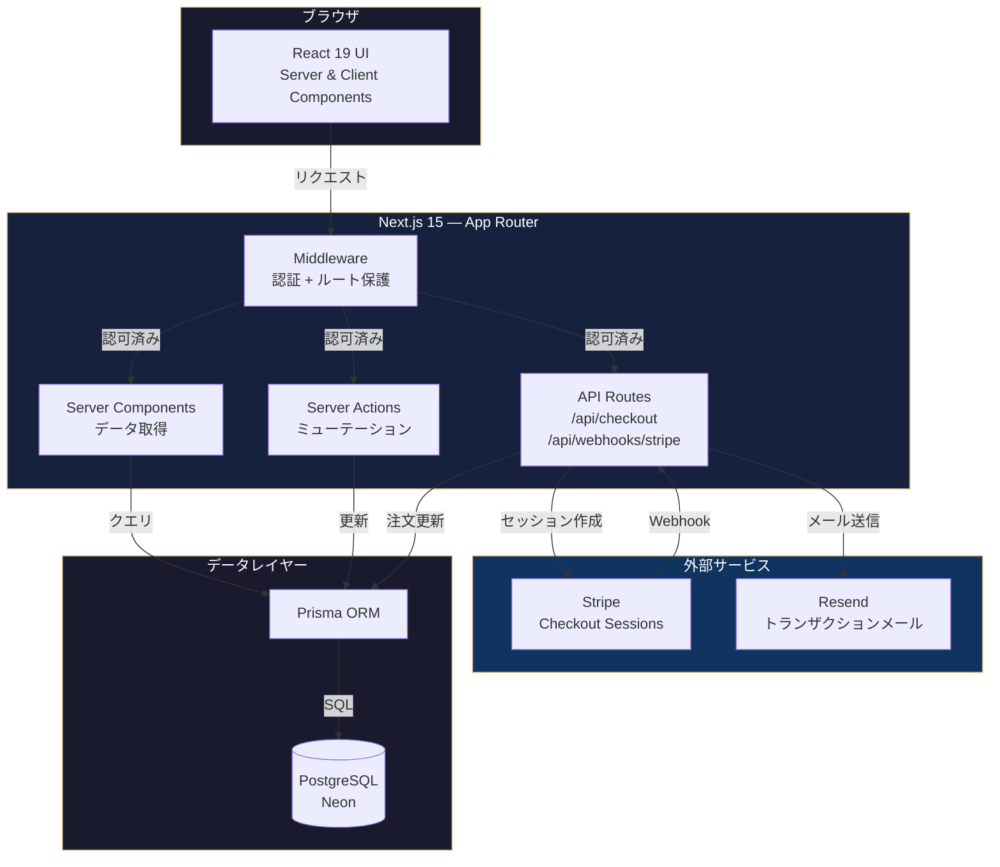
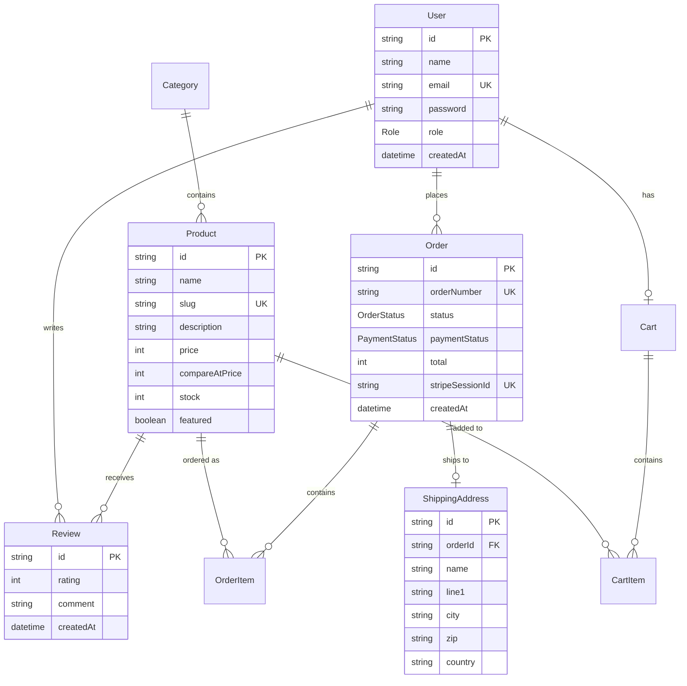

<div align="center">

# LUXE

### ラグジュアリーファッション ECプラットフォーム

**Next.js 15 / React 19 / Stripe / PostgreSQL** で構築した本格フルスタックECアプリケーション。
ストアフロントから管理画面、認証から決済処理までエンドツーエンドで実装。

[](https://nextjs.org/)
[](https://react.dev/)
[](https://www.typescriptlang.org/)
[](https://stripe.com/)
[](https://neon.tech/)
[](https://tailwindcss.com/)
[](https://www.prisma.io/)

**日本語** | [English](./README.en.md)

**ライブデモ:** [https://luxe-store-ruby.vercel.app](https://luxe-store-ruby.vercel.app)

</div>

---

## なぜこのプロジェクトか

ポートフォリオのECアプリの多くは「カートに追加」で終わります。LUXE はその先——チュートリアルと本番システムを分ける**実務上の関心事**まで実装しています：

- **楽観的在庫ロック** — 同時チェックアウト時の過剰販売を防止
- **Webhook 駆動の注文処理** — Stripe 署名検証つき
- **補償トランザクション** — Stripe セッション作成失敗時に引当済み在庫を解放（在庫リーク防止）
- **トランザクションメール** — 決済確認時に Resend で送信（失敗しても注文は止めない）
- **ロールベースアクセス制御（RBAC）** — Middleware レベルのルート保護
- **管理バックオフィス** — KPI ダッシュボードと注文ライフサイクル管理
- **セキュリティ強化** — HSTS・クリックジャッキング対策・厳格な Referrer-Policy・bcrypt ハッシュ
- **多言語対応（i18n）** — next-intl による日英切替、ロケール連動の通貨表示（¥ ↔ $）
- **単体テスト** — 決済・在庫の中核ロジックを Vitest で担保（21 件）

---

## 技術スタック

| レイヤー | 技術 | 用途 |
|:---------|:-----|:-----|
| フレームワーク | Next.js 15（App Router） | Server Components、Server Actions、Middleware |
| UI | React 19、Tailwind CSS 3.4、shadcn/ui | Radix Primitives ベースのコンポーネントシステム |
| 言語 | TypeScript 5.7（strict） | エンドツーエンドの型安全性 |
| データベース | PostgreSQL（Neon） | マネージド PostgreSQL |
| ORM | Prisma 6.2 | スキーマファースト・型安全なDB操作 |
| 認証 | NextAuth.js v5（beta） | JWT セッション、Credentials プロバイダー、RBAC |
| 決済 | Stripe Checkout + Webhooks | PCI 準拠の決済処理 |
| メール | Resend | 注文確認トランザクションメール |
| バリデーション | Zod | 認証・商品管理・レビュー入力のランタイムスキーマ検証 |
| テスト | Vitest | 決済・在庫ロジックの単体テスト（Stripe / Prisma はモック） |
| チャート | Recharts | 管理画面の月次売上グラフ |
| 国際化 | next-intl 4.x | 日英切替、Cookie ベースロケール、通貨フォーマット連動 |
| アイコン | Lucide React | 統一されたアイコンシステム |

---

## アーキテクチャ


```mermaid
graph TB
    subgraph Client["ブラウザ"]
        UI["React 19 UI<br/>Server & Client Components"]
    end

    subgraph NextJS["Next.js 15 — App Router"]
        MW["Middleware<br/>認証 + ルート保護"]
        RSC["Server Components<br/>データ取得"]
        SA["Server Actions<br/>ミューテーション"]
        API["API Routes<br/>/api/checkout<br/>/api/webhooks/stripe"]
    end

    subgraph Services["外部サービス"]
        STRIPE["Stripe<br/>Checkout Sessions"]
        RESEND["Resend<br/>トランザクションメール"]
    end

    subgraph Data["データレイヤー"]
        PRISMA["Prisma ORM"]
        DB[("PostgreSQL<br/>Neon")]
    end

    UI -->|リクエスト| MW
    MW -->|認可済み| RSC
    MW -->|認可済み| SA
    MW -->|認可済み| API
    RSC -->|クエリ| PRISMA
    SA -->|更新| PRISMA
    API -->|セッション作成| STRIPE
    STRIPE -->|Webhook| API
    API -->|注文更新| PRISMA
    API -->|メール送信| RESEND
    PRISMA -->|SQL| DB

    style Client fill:#1a1a2e,stroke:#C9A96E,color:#fff
    style NextJS fill:#16213e,stroke:#C9A96E,color:#fff
    style Services fill:#0f3460,stroke:#C9A96E,color:#fff
    style Data fill:#1a1a2e,stroke:#C9A96E,color:#fff
```

---

## データベース設計

### ER図（9 モデル、3 enum）


```mermaid
erDiagram
    User ||--o| Cart : has
    User ||--o{ Order : places
    User ||--o{ Review : writes
    Category ||--o{ Product : contains
    Product ||--o{ CartItem : "added to"
    Product ||--o{ OrderItem : "ordered as"
    Product ||--o{ Review : receives
    Cart ||--o{ CartItem : contains
    Order ||--o{ OrderItem : contains
    Order ||--o| ShippingAddress : "ships to"

    User {
        string id PK
        string name
        string email UK
        string password
        Role role
        datetime createdAt
    }

    Product {
        string id PK
        string name
        string slug UK
        string description
        int price
        int compareAtPrice
        int stock
        boolean featured
    }

    Order {
        string id PK
        string orderNumber UK
        OrderStatus status
        PaymentStatus paymentStatus
        int total
        string stripeSessionId UK
        datetime createdAt
    }

    ShippingAddress {
        string id PK
        string orderId FK
        string name
        string line1
        string city
        string zip
        string country
    }

    Review {
        string id PK
        int rating
        string comment
        datetime createdAt
    }
```

**enum:**
- `Role` — CUSTOMER, ADMIN
- `OrderStatus` — PENDING, CONFIRMED, PROCESSING, SHIPPED, DELIVERED, CANCELLED
- `PaymentStatus` — PENDING, PAID, FAILED, REFUNDED, EXPIRED

**価格戦略:** 全価格をセント整数で保存（例: $28.90 = 2890）。浮動小数点演算エラーを回避し、Stripe API のセント単位と整合。

**インデックス:** `Order`（userId / status / createdAt）、`OrderItem`（orderId / productId）。

**シードデータ:** 2 ユーザー（Admin + Customer）、5 カテゴリ、20 商品、10 レビュー、5 注文。

---

## 主要機能

### ストアフロント

- **商品カタログ** — カテゴリフィルター、価格ソート、キーワード検索（大文字小文字を区別しない部分一致）
- **商品詳細** — 画像ギャラリー、サイズ選択、在庫バリデーション、カスタマーレビュー（1〜5星評価＋コメント）
- **ショッピングカート** — 商品追加・数量変更・削除、ヘッダーにリアルタイム個数バッジ
- **Stripe 決済** — Stripe Hosted Checkout へリダイレクト、配送先住所収集（US / CA / GB）、セッション有効期限 30 分
- **注文履歴** — 注文ステータス・支払いステータスのバッジ表示

### 多言語対応（i18n）

- **言語トグル** — ヘッダーの `JP | EN` リンクでページリロードなしに切替（`useTransition` + `router.refresh()`）
- **Cookie ベースロケール** — `NEXT_LOCALE` Cookie（有効期限 1 年）、URL プレフィックスなし
- **通貨連動** — JP: `¥8,950`（税込表示）/ EN: `$89.50 + Tax`。Stripe に送る決済金額（セント整数）は不変で、表示レイヤーのみ切替
- **翻訳範囲** — ストアフロント・認証・管理画面全体（約 200 キー、日英完全同期）
- **Server / Client 両対応** — Server Components は `getTranslations()`、Client Components は `useTranslations()`

### 認証・認可

- **JWT セッション** — 24 時間有効のステートレスセッション（NextAuth.js v5）
- **Middleware ルート保護** — `/admin/*`、`/orders`、`/checkout`、`/cart` をエッジで保護
- **RBAC** — ADMIN / CUSTOMER をサーバー側で強制（Middleware ＋ Server Action の二重チェック）
- **パスワードハッシュ** — bcrypt 12 ラウンド

### 管理画面

- **KPI カード** — 総売上、総注文数、平均注文額、新規顧客数
- **月次売上チャート** — 直近 6 ヶ月の棒グラフ（Recharts）
- **商品管理** — Zod バリデーション付きの完全 CRUD
- **注文管理** — ステータスライフサイクル更新（Pending → Confirmed → Processing → Shipped → Delivered）
- **顧客一覧** — 注文数・登録日つき顧客リスト

---

## 決済フローアーキテクチャ

```
カート ──▶ POST /api/checkout
                │
                ├── 在庫バリデーション
                ├── 楽観的在庫ロック（$transaction 内で stock >= qty の条件付き decrement）
                ├── Order 作成（status: PENDING）
                └── Stripe Checkout Session 作成（有効期限 30 分）
                        │
                        ├─ 作成失敗 ──▶ 補償トランザクション:
                        │               在庫復元 + 注文 CANCELLED / FAILED
                        │               （Webhook が参照できない注文を残さない）
                        ▼
              顧客が Stripe 上で決済
                        │
        ┌───────────────┼────────────────────┐
        ▼               ▼                    ▼
    決済成功        決済試行の失敗       セッション期限切れ
   checkout.        payment_intent.      checkout.
   session.         payment_failed       session.expired
   completed            │                    │
        │               ▼                    ▼
        ▼        ┌────────────────┐  ┌────────────────┐
┌────────────────┐│ Session 逆引き  │  │ 在庫復元        │
│ 署名検証        ││ で注文を特定    │  │ （increment）   │
│ 冪等性チェック   ││ Payment →      │  │ 注文 CANCELLED  │
│ Order→CONFIRMED││   FAILED       │  │ / EXPIRED      │
│ Payment→PAID   ││ 在庫は保持      │  └────────────────┘
│ 配送先住所保存   ││ （リトライ可、   │
│ カートクリア     ││  期限切れで解放）│
│ 確認メール送信   │└────────────────┘
└────────────────┘
        │
        ▼
  /checkout/success へリダイレクト
```

**ハンドリング済みのエッジケース:**

- **Stripe セッション作成失敗** → 補償トランザクションで引当済み在庫を解放し、注文を CANCELLED に（在庫リーク防止）
- **セッション期限切れ（30 分）** → 在庫復元、注文キャンセル
- **決済試行の失敗** → PaymentIntent から Checkout Session を逆引きして注文を特定し、支払いステータスを FAILED に。在庫はセッション期限まで保持（顧客はリトライ可能）
- **メール送信失敗** → ログ出力のみ、注文処理はブロックしない
- **同時チェックアウト** → 楽観的在庫ロックで過剰販売を防止
- **Webhook の重複配信** → 冪等性チェック（PAID 済み注文は再処理しない）

---

## セキュリティ

| 脅威 | 対策 |
|:-----|:-----|
| パスワード漏洩 | bcrypt 12 ラウンドでハッシュ化 |
| セッションハイジャック | JWT 24 時間有効期限、ステートレス設計 |
| 不正アクセス | NextAuth Middleware によるルート保護、RBAC |
| Webhook 偽装 | Stripe 署名検証（`webhooks.constructEvent`、全イベント） |
| SQL インジェクション | Prisma パラメータ化クエリ |
| クリックジャッキング | `X-Frame-Options: DENY` |
| MIME スニッフィング | `X-Content-Type-Options: nosniff` |
| 中間者攻撃 | `Strict-Transport-Security`（2 年、preload 付き） |
| 情報漏洩 | `Referrer-Policy: strict-origin-when-cross-origin` |
| デバイス API 悪用 | `Permissions-Policy: camera=(), microphone=(), geolocation=()` |
| 不正入力 | Zod スキーマによるランタイムバリデーション（認証・商品管理・レビュー） |
| 過剰販売 | 楽観的在庫ロック（`$transaction` 内で `stock >= quantity` を条件付き更新） |

---

## テスト

決済・在庫まわりの中核ロジックを **Vitest 単体テスト 21 件**で担保。Stripe / Prisma は全てモックし、実キー・実 DB なしで実行できます。

| 対象 | 検証内容 |
|:-----|:---------|
| `POST /api/checkout`（`tests/checkout.test.ts`） | 認証チェック、事前在庫バリデーション、楽観的ロック（条件付き decrement / 競合時 abort）、税の別行計上、**Stripe セッション作成失敗時の補償トランザクション（在庫解放＋注文キャンセル）** |
| Webhook 署名検証（`tests/webhook-signature.test.ts`） | 署名ヘッダー欠落 / 不正署名での 400 応答、raw body・シークレットの検証、未処理イベントの ACK |
| Webhook ハンドラー（`tests/webhook-handlers.test.ts`） | `completed` の冪等性・カートクリア・配送先保存、`expired` の在庫復元、`payment_failed` の Session 逆引きと PAID 注文の非降格 |

```bash
npm test   # vitest run
```

---

## プロジェクト構成

```
src/
├── app/                          # Next.js App Router
│   ├── admin/                    # 管理画面（ADMIN ロール限定）
│   │   ├── customers/page.tsx
│   │   ├── orders/page.tsx
│   │   ├── products/page.tsx
│   │   ├── layout.tsx
│   │   └── page.tsx              # KPI + 売上チャート
│   ├── api/
│   │   ├── auth/[...nextauth]/   # NextAuth エンドポイント
│   │   ├── checkout/             # Stripe セッション作成 + 在庫ロック
│   │   └── webhooks/stripe/      # Stripe Webhook ハンドラー
│   ├── cart/page.tsx
│   ├── checkout/
│   │   ├── cancel/page.tsx
│   │   ├── success/page.tsx
│   │   └── page.tsx
│   ├── login/page.tsx
│   ├── orders/page.tsx
│   ├── products/
│   │   ├── [id]/page.tsx         # 商品詳細 + レビュー
│   │   └── page.tsx              # カタログ（フィルター + ソート）
│   ├── register/page.tsx
│   ├── globals.css
│   └── layout.tsx                # ルートレイアウト + フォント
│
├── components/
│   ├── admin/                    # 管理画面コンポーネント
│   ├── auth/                     # ログイン・登録フォーム
│   ├── cart/                     # カートアイテム、サマリー
│   ├── checkout/                 # チェックアウトフォーム
│   ├── layout/                   # ヘッダー、フッター、言語トグル
│   ├── orders/                   # 注文リスト、ステータスバッジ
│   ├── products/                 # カード、グリッド、フィルター、ギャラリー
│   ├── reviews/                  # レビューフォーム・リスト
│   └── ui/                       # shadcn/ui プリミティブ（14 コンポーネント）
│
├── i18n/
│   ├── config.ts                 # ロケール定義（ja, en）
│   └── request.ts                # next-intl リクエスト設定（Cookie ベース）
│
├── messages/
│   ├── ja.json                   # 日本語翻訳
│   └── en.json                   # 英語翻訳
│
├── lib/
│   ├── actions/                  # Server Actions
│   │   ├── auth.ts               # 登録（Zod + bcrypt）、ログイン
│   │   ├── cart.ts               # カート CRUD
│   │   ├── locale.ts             # 言語切替（setLocale）
│   │   ├── orders.ts             # 注文ステータス更新（ADMIN 限定）
│   │   ├── products.ts           # 商品 CRUD（ADMIN 限定、Zod）
│   │   └── reviews.ts            # レビュー作成（Zod）
│   ├── auth.config.ts            # NextAuth ルート設定 + RBAC
│   ├── auth.ts                   # NextAuth インスタンス
│   ├── constants.ts              # ステータス、サイズ、税率
│   ├── order-number.ts           # 注文番号生成（LUXE-YYYYMMDD-NNN）
│   ├── prisma.ts                 # Prisma シングルトン
│   ├── stripe.ts                 # Stripe シングルトン
│   ├── resend.ts                 # Resend シングルトン
│   └── utils.ts                  # cn(), formatPrice(), formatDate()
│
├── types/index.ts                # 共有 TypeScript 型定義
└── middleware.ts                 # 認証ミドルウェア + ルートマッチャー

tests/                            # Vitest 単体テスト（Stripe / Prisma モック）
├── checkout.test.ts              # 在庫引当・解放 + 補償トランザクション
├── webhook-signature.test.ts     # Webhook 署名検証
└── webhook-handlers.test.ts      # completed / expired / payment_failed

prisma/
├── schema.prisma                 # 9 モデル、3 enum
├── seed.ts                       # シードスクリプト
└── migrations/
```

---

## デザインシステム

### タイポグラフィ

| 役割 | フォント | ウェイト |
|:-----|:---------|:--------|
| 見出し | Playfair Display（serif） | 400–700 |
| 本文 | Inter（sans-serif） | 300–700 |

### カラーパレット

| トークン | 値 | 用途 |
|:---------|:---|:-----|
| `gold` | `#C9A96E` | ブランドカラー、CTA、アクセント |
| `gold-light` | `#D4BC8E` | ホバー状態 |
| `gold-dark` | `#B08D4F` | アクティブ状態 |
| `background` | `hsl(0 0% 100%)` | ページ背景 |
| `foreground` | `hsl(0 0% 3.9%)` | 本文テキスト |
| `muted` | `hsl(0 0% 96.1%)` | セカンダリ面 |
| `destructive` | `hsl(0 84.2% 60.2%)` | エラー、削除操作 |

[shadcn/ui](https://ui.shadcn.com/)（Radix Primitives）ベースの 14 基本コンポーネントを、商品・カート・注文・管理画面のドメインコンポーネントで拡張。

---

## セットアップ

### 前提条件

- Node.js 18 以上
- PostgreSQL データベース（[Neon](https://neon.tech/) 推奨）
- [Stripe](https://stripe.com/) アカウント（テストモード）
- [Resend](https://resend.com/) アカウント

### 1. クローン・インストール

```bash
git clone https://github.com/mer-prog/luxe-store.git
cd luxe-store
npm install
```

### 2. 環境変数の設定

```bash
cp .env.example .env
```

```env
# データベース（Neon PostgreSQL）
DATABASE_URL="postgresql://..."
DIRECT_URL="postgresql://..."

# NextAuth.js
AUTH_SECRET="openssl rand -base64 32"
AUTH_URL="http://localhost:3000"

# Stripe
STRIPE_SECRET_KEY="sk_test_..."
STRIPE_WEBHOOK_SECRET="whsec_..."
NEXT_PUBLIC_STRIPE_PUBLISHABLE_KEY="pk_test_..."

# メール（Resend）
RESEND_API_KEY="re_..."
EMAIL_FROM="LUXE Store <noreply@yourdomain.com>"

# アプリ URL
NEXT_PUBLIC_APP_URL="http://localhost:3000"

# シードデータ（任意）
SEED_ADMIN_PASSWORD="change-me-admin"
SEED_USER_PASSWORD="change-me-user"
```

### 3. データベースセットアップ

```bash
npx prisma migrate dev    # マイグレーション適用
npm run db:seed            # サンプルデータ投入
```

### 4. Stripe Webhook リスナー起動（開発環境）

```bash
stripe listen --forward-to localhost:3000/api/webhooks/stripe
```

### 5. 開発サーバー起動

```bash
npm run dev
```

[http://localhost:3000](http://localhost:3000) にアクセス。

### テストアカウント（シード後）

| ロール | メールアドレス | パスワード |
|:-------|:--------------|:-----------|
| 管理者 | `admin@example.com` | `SEED_ADMIN_PASSWORD` で設定した値 |
| 顧客 | `user@example.com` | `SEED_USER_PASSWORD` で設定した値 |

---

## npm スクリプト

| コマンド | 内容 |
|:---------|:-----|
| `npm run dev` | 開発サーバー起動 |
| `npm run build` | 本番ビルド |
| `npm run start` | 本番サーバー起動 |
| `npm test` | 単体テスト実行（Vitest） |
| `npm run lint` | ESLint 実行 |
| `npm run db:push` | スキーマを DB に反映 |
| `npm run db:seed` | シードデータ投入 |
| `npm run db:migrate` | マイグレーション作成・適用 |

---

## 設計判断の根拠

| 判断 | 根拠 |
|:-----|:-----|
| **App Router（Pages Router ではなく）** | Server Components でクライアントバンドル削減、Server Actions で API ボイラープレート排除 |
| **JWT セッション（DB セッションではなく）** | ステートレス認証で水平スケール可能、24 時間有効期限でセキュリティと UX を両立 |
| **Stripe Hosted Checkout（Elements ではなく）** | PCI 準拠が標準で含まれる、配送先住所収集が組み込み、カスタムフォーム面を削減 |
| **Webhook 駆動の注文処理** | 決済確認をユーザーセッションから分離、期限切れ・決済失敗を非同期でハンドリング |
| **楽観的在庫ロック** | Stripe チェックアウト中の過剰販売を分散ロックなしで防止 |
| **補償トランザクション** | 在庫引当後に Stripe セッション作成が失敗した場合、在庫解放＋注文キャンセルで整合性を回復（Webhook が参照できない注文を残さない） |
| **Prisma（生 SQL ではなく）** | 型安全クエリ + 自動生成型、スキーマファーストマイグレーション |
| **価格をセント整数で保存** | 浮動小数点演算エラーの回避、Stripe API のセント単位と整合 |
| **シングルトンパターン（Prisma / Stripe / Resend）** | サーバーレス環境・開発時ホットリロードでのコネクション枯渇を防止 |
| **ロケール連動通貨フォーマット** | 言語切替で通貨表示も連動（¥ ↔ $）、決済ロジック（セント整数）は不変 |
| **Cookie ベース i18n（URL プレフィックスなし）** | 商品 URL 構造（`/products/[id]`）を維持。デモ用ポートフォリオのため SEO より URL 簡潔さを優先 |

---

## 運用コスト

| サービス | プラン | 月額 |
|:---------|:-------|:-----|
| Vercel | Hobby | 無料 |
| Neon PostgreSQL | Free Tier | 無料 |
| Stripe | 従量課金 | 決済額の 3.6%（テストモードは無料） |
| Resend | Free Tier | 無料（月 3,000 通まで） |
| **合計** | | **$0（テストモード運用時）** |

---

## ライセンス

本プロジェクトはポートフォリオ・学習目的で公開しています。

---

<div align="center">

Built by [mer-prog](https://github.com/mer-prog)

</div>
